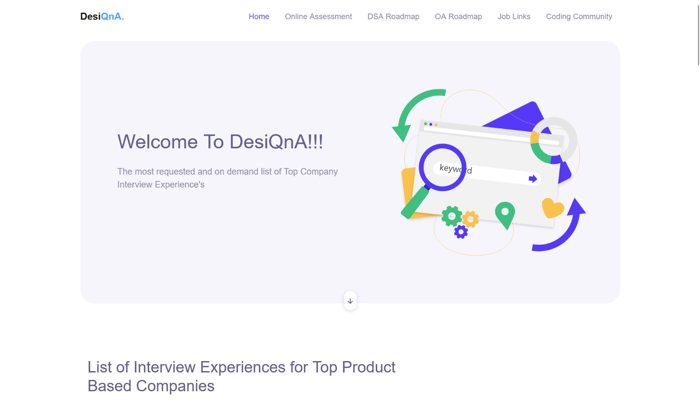
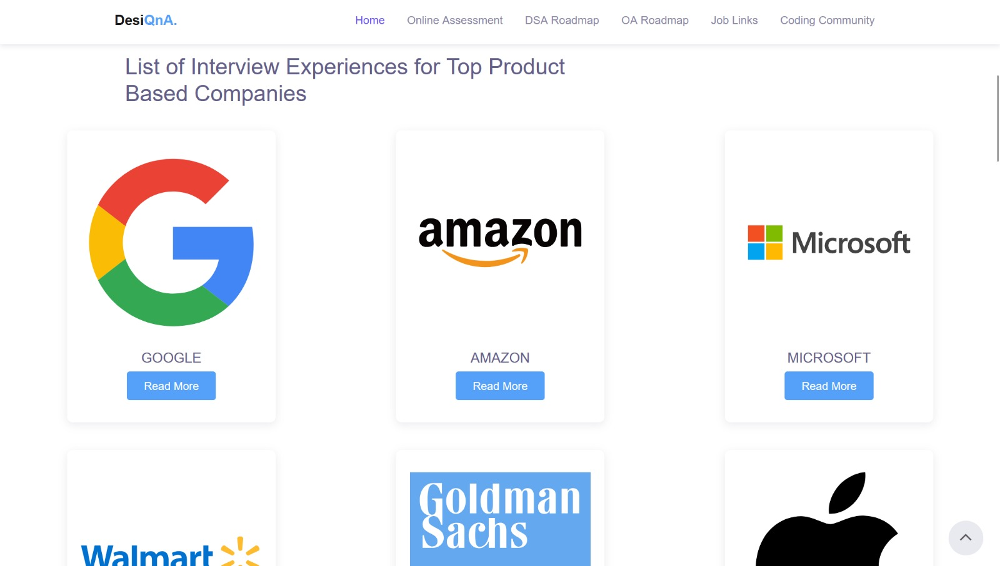
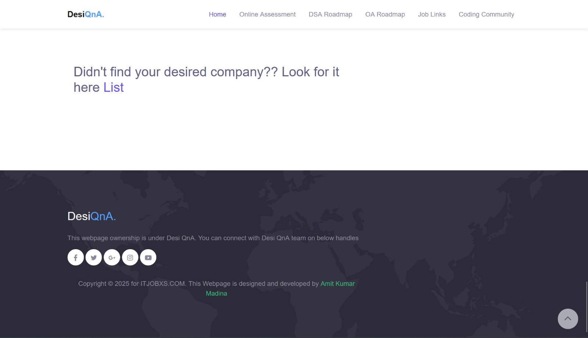

# Interview Experiences Webpage – ITJOBXS

## 📌 Project Overview

This project is a **fully responsive Interview Experiences Webpage** developed during my **Software Development Engineer (SDE) Internship at ITJOBXS**.

The webpage is designed to help job seekers **read and explore interview experiences of different companies**, enabling better preparation for technical and HR interviews.

---

## 🏢 Organization Details

- **Company**: ITJOBXS  
- **Website**: https://www.itjobxs.com  
- **Domain**: Jobs & Education Website  
- **Internship Role**: SDE Intern @ ITJOBXS  

---

## 🎯 My Role & Contribution (Frontend Only)

As an **SDE Intern**, I worked exclusively on the **frontend design and development** of the Interview Experiences webpage.

### ✔ Responsibilities
- Designed and developed a **responsive interview experiences webpage**
- Created structured layouts using **HTML5**
- Styled the webpage using **CSS3 and Bootstrap**
- Used **JavaScript** for basic UI interactions
- Ensured mobile and desktop responsiveness
- Built a **duplicate frontend version** of the original page for testing and review

### ❌ Out of Scope
- Backend development  
- PHP or MySQL  
- Authentication or security logic  
- Spam or bot prevention  

---

## 🌐 Project Links

- **Frontend GitHub Repository**:  
 [ https://github.com/amitkumarmadina/DesiQna-Interview-Experiences-main](https://github.com/amitkumarmadina/Interview-Experiance-Webpage)

- **Live**:  
 [Live DEMO](https://amitkumarmadina.github.io/Interview-Experiance-Webpage/)

> This repository represents a **frontend duplicate version** created during my internship.
---

## 🛠️ Tech Stack Used

**Frontend**
- HTML5  
- CSS3  
- JavaScript  
- Bootstrap  
